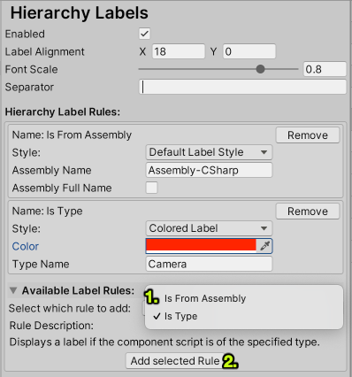

# Hierarchy Labels

Custom labels for the Unity Hierarchy window:

## Features

- Display a label (or multiple) for each element in Unity's hierarchy window
- Add custom rules for displaying a label
- Custom label styling

## How to use

Install the package, and head over to `ProjectSettings/Hierarchy Labels`:

Use the dropdown menu `Select which rule to add:` to select your rule, then click `Add selected Rule`.
Configure your rule in the list above.

## Built-In Rules

- `DisplayScriptsFromSpecifiedAssemblyHierarchyRule ("Is From Assembly")`: Displays a label if the component script is from the specified assembly.
You can configure if the name of the assembly should be matched fully or just contain the specfied text, i.e. unchecking `Assembly Full Name` will make `TextMeshPro` match any TMPro component, while checking it will not, since the full assembly name is `Unity.TextMeshPro`.
- `DisplaySpecificComponentTypeHierarchyRule ("Is Type")`:
Displays a label if the component script is of the specified type.
