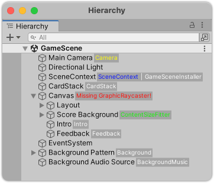
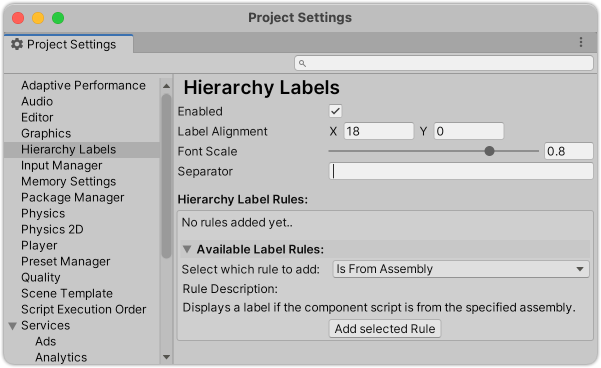
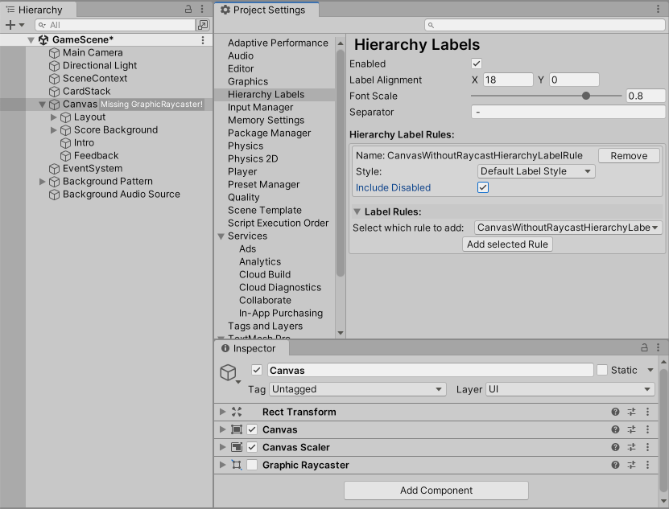

# Hierarchy Labels

Custom labels for the Unity Hierarchy window:



## Features

- Display a label (or multiple) for each element in Unity's hierarchy window
- Add custom rules for displaying a label
- Custom label styling

## How to use

Install the package, and head over to `ProjectSettings/Hierarchy Labels`:


Use the dropdown menu `Select which rule to add:` to select your rule, then click `Add selected Rule`.
Configure your rule in the list above.


## Built-in rules

- `DisplayScriptsFromSpecifiedAssemblyHierarchyRule ("Is From Assembly")`: Displays a label if the component script is from the specified assembly.
You can configure if the name of the assembly should be matched fully or just contain the specfied text, i.e. unchecking `Assembly Full Name` will make `TextMeshPro` match any TMPro component, while checking it will not, since the full assembly name is `Unity.TextMeshPro`.
- `DisplaySpecificComponentTypeHierarchyRule ("Is Type")`:
Displays a label if the component script is of the specified type.

## Custom Rules

### How to add your own rule

Let's say we want to add a rule that adds a label reminding us if a GameObject, that has a `Canvas` component has no `GraphicRaycaster`:

Add a new class that inherits from `HierarchyLabelRule` (recommended) or implements `IHierarchyLabelRule`.

```c-sharp
using System;
using HierarchyLabels;
using UnityEngine;
using UnityEngine.UI;

[Serializable]
public class CanvasWithoutRaycastHierarchyLabelRule : HierarchyLabelRule
{
    public override bool GetLabel(Component component, out string label)
    {
        label = string.Empty;

        if (component is Canvas && !component.GetComponent<GraphicRaycaster>())
        {
            label = "Missing GraphicRaycaster!";
            return true;
        }

        return false;
    }
}
```


At 1. you can see your new label in action (note there is no `GraphicRaycaster` component on the selected GameObject in the Inspector).
At 2. you can see that your rule is now selectable in the dropdown menu for rules to be added.
At 3. you can see your rule is added in the active rules list.

### How to make your rule configurable

Given the example above, let's say we want to add the option to also include disabled `GraphicRaycaster` components:

For this, we add a `[SerializedField]` to the class above:

```c-sharp
using System;
using HierarchyLabels;
using UnityEngine;
using UnityEngine.UI;

[Serializable]
public class CanvasWithoutRaycastHierarchyLabelRule : HierarchyLabelRule
{
    //All serialized fields will show up in the settings and can be used to configure your rule
    [SerializeField] private bool _includeDisabled;

    public override bool GetLabel(Component component, out string label)
    {
        label = string.Empty;

        if (component is Canvas && IsRaycastDisabledOrMissing(component))
        {
            label = "Missing GraphicRaycaster!";
            return true;
        }

        return false;
    }

    private bool IsRaycastDisabledOrMissing(Component component)
    {
        return !component.GetComponent<GraphicRaycaster>() ||
               _includeDisabled && !component.GetComponent<GraphicRaycaster>().enabled;
    }
}
```

Any `[SerializedField]` will show up in the preferences window and can be used to configure your rule.



The example above now shows the option to include disabled components, and it properly shows the label on the GameObject in the hierarchy (not the disabled `GraphicalRaycaster` on the selected object).

### Add name and description for your rule

In the examples above you can see that the names of the rules can get quite long and clutter the UI. To prevent this you can add the `[DisplayName]` and `[Description]` attributes to your rule class. The settings UI will then use the provided name instead and show a description if any is provided.

```c-sharp
using System;
using System.ComponentModel;
using HierarchyLabels;
using UnityEngine;
using UnityEngine.UI;
using Component = UnityEngine.Component;

[Serializable,
 DisplayName("Missing Raycaster on Canvas"),
 Description("Shows a label if a Canvas is attached but no GraphicalRaycaster is present or it is disabled.")]
public class CanvasWithoutRaycastHierarchyLabelRule : HierarchyLabelRule
{
    [SerializeField] private bool _includeDisabled;

    public override bool GetLabel(Component component, out string label)
    {
        label = string.Empty;

        if (component is Canvas && IsRaycastDisabledOrMissing(component))
        {
            label = "Missing GraphicRaycaster!";
            return true;
        }

        return false;
    }

    private bool IsRaycastDisabledOrMissing(Component component)
    {
        return !component.GetComponent<GraphicRaycaster>() ||
               _includeDisabled && !component.GetComponent<GraphicRaycaster>().enabled;
    }
}
```


### Tips for adding custom rules

- Try to keep expensive method calls like `GetComponent()` to a minimum.
- Use `ISerializationCallbackReceiver` or `[InitializeOnLoadMethod]`-attributes to do expensive calls instead of in each `GetLabel()` call.
- If you implement `IHierarchyLabelRule` instead of inheriting from `HierarchyLabelRule`, it is recommended to call `EditorApplication.RepaintHierarchyWindow()` after any settings in your rule have changed, e.g. via the `ISerializationCallbackReceiver.OnBeforeSerialize()` method.
- Make sure to add the `[Serializable]` attribute to your rule implementation class.

### Known limitations

- If your rule is based on some values of a GameObject, i.e. if a component is disabled or not, changing that value on the GameObject will not immediately trigger a redraw of the hierarchy window, and hence your label might not show/hide immediately, except if this dirties the scene.
- If you rename your class, change it's namespace, or it's assembly is modified, the rule is removed from the list of active rules and has to be re-added (`Missing types referenced` warning in the console). This is a limitation by Unity, and is [possibly addressed in the future]((https://issuetracker.unity3d.com/issues/serializereference-serialized-reference-data-lost-when-the-class-name-is-refactored)).

### Future Plans

- Provide better styling options
